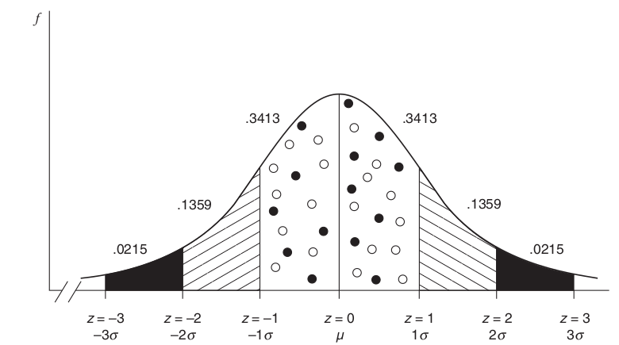

# Standardization and z Scores

- If you know the mean and standard deviation of a distribution of scores, you have enough information to develop a picture of the distribution.
- Sometimes researchers are interested in describing individual scores within a distribution. 
- Using the mean and the standard deviation, researchers are able to generate a standard score, also called *a **z score**, to help them understand where an individual score falls in relation to other scores in the distribution*.
- Through a process of **standardization**, researchers are also better **able to compare individual scores in the distributions of two separate variables**.
- ***Standardization is simply a process of converting each score in a distribution to a z score***.
- **A z score is a number that indicates how far above or below the mean a given score in the distribution is in standard deviation units. So standardization is simply the process of converting individual raw scores in the distribution into standard deviation units.**
- Suppose that you are a college student taking final exams. In your biology class, you take your final exam and get a score of 65 out of a possible 100. In your statistics final, you get a score of 42 out of 200. On which exam did you get a “better” score? The answer to this question may be more complicated than it appears. First, we must determine what we mean by “better.” If better means the percentage of correct answers on the exam, clearly you did better on the biology exam. But if your statistics exam was much more difficult than your biology exam, is it fair to judge your performance solely on the basis of the percentage of correct responses? A fairer alternative may be to see how well you did compared to other students in your classes. To make such a comparison, we need to know the mean and standard deviation of each distribution. With these statistics, we can generate z scores (a.k.a. standard scores).

## Standardization and z-scores in Depth
- It is often difficult to compare two scores for two variables when the variables are measured using different scales. The biology test in the example was measured on a scale from 1 to 100, whereas the statistics exam used a scale from 1 to 200. When variables have such different scales of measurement, it is almost meaningless to compare the raw scores (i.e., 65 and 42 on these exams). Instead, we need some way to put these two exams on the
same scale, or to standardize them. One of the most common methods of standardization used in statistics is to convert raw scores into standard deviation units, or z scores.
- The formula:  $$z = \frac{raw score-mean}{standard\quad deviation}$$ or 
$$z = \frac{X-\mu}{\sigma}$$ or $$z = \frac{X-\overline{X}}{s}$$

## Interpreting z Scores

- z scores tell researchers instantly how large or small an individual score is relative to other scores in the distribution. For example, if I know that one of my students got a z score of –1.5 on an exam, I would know that student scored 1.5 standard deviations below the mean on that exam. If another student had a z score of .29, I would know the student scored .29 standard deviation units above the mean on the exam.
- Let’s pause here and think for a moment about what z scores do not tell us. If I told you that I had a z score of 1.0 on my last spelling test, what would you think of my performance? What you would know for sure is that

(a) I did better than the average person taking the test,
(b) my score was one standard deviation above the mean, and 
(c) if the scores in the distribution were normally distributed, my score was better than about 84 percent of the scores in the distribution. But what you would not know would be 
	(a) how many words I spelled correctly, 
	(b) if I am a good speller, 
	(c) how difficult the test was, 
	(d) if the other people that took the test are good spellers, 
	(e) how many other people took the test, and so on.

- As you can see, a z score alone does not provide as much information as we might want. To further demonstrate this point, suppose that after I told you I had a z score of 1.0 on the spelling test, I went on to tell you that the average score on the test was 12 out of 50 and that everyone else who took the test was seven years old. Not very impressive in that context, is it?

- 

## Wrapping Up and Looking Forward

- z scores provide a handy way of interpreting where a raw score is in relation to the mean. 
- We can use z scores to quickly and easily determine where an individual score in a distribution falls relative to other scores in the distribution, either by interpreting the z score in standard deviation units or by calculating percentile scores.

