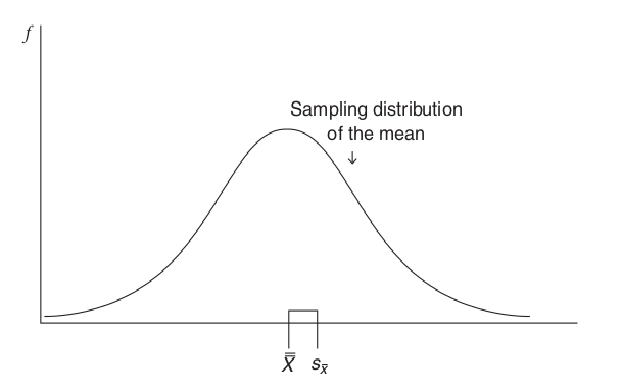

# Standard Errors

- when one is able to truly understand the concept of standard error, many of our most beloved inferential statistics (t tests, ANOVA, regression coefficients, correlations) become easy to understand.
- Inferential statistics is all about using information collected from samples to reach conclusions about the populations the samples came from. In the inferential statistics that we will see, the formulas are all basically the same: How large is the effect that you observe in your sample data compared to the amount of error you would expect to get just due to chance?*(In inferential statistics,** chance means random sampling error, or the error you would expect just due to random sampling.**)* As you will see when we discuss t test, F values, and correlation coefficients, the formulas for the inferential statistics all have this same general formula, with the observed effect in the sample as the numerator of the formulas and the error due to chance as the denominator.

## What Is a Standard Error?

- **The standard error is the measure of how much *random* variation we would expect from samples of equal size drawn from the same population.**

## The Conceptual Description of the Standard Error of the Mean

- Let's describe what is Sampling distribution first. We take out lots of samples from population and those samples have mean and standard deviation. We calculate all samples mean, this mean of all samples form a distribution. This distribution of means (taken from samples) are known as Sampling distribution of the mean.
- The mean of mean(sampling distribution) sample distribution is known as the **expected value of the mean**.
- It is called expected value because the mean of the sampling distribution of the mean is the same as the population mean.
- The Standard deviation of the Sampling distribution of the mean is called standard error.
- So the standard error is simply the standard deviation of the sampling distribution.

---
The final step in understanding the concept of standard error of the mean is to understand what this statistic tells us.

- The standard deviation tells us the average difference, or deviation, between an individual score in the distribution and the mean for the distribution. 
- The standard error of the mean provides essentially the same information, except it refers to the average difference between the expected value (e.g., the population mean) and an individual sample mean.

	- So one way to think about the standard error of the mean is that it tells us how confident we should be that a sample mean represents the actual population mean.
	- Phrased another way, the standard error of the mean provides a measure of how much error we can expect when we say that a sample mean represents the mean of the larger population. That is why it is called a standard error.
	- Knowing how much error we can expect when selecting a sample of a given size from a population is critical in helping us determine whether our sample statistic, such as the sample mean, is meaningfully different from the population parameter, such as the population mean. 
	- This is the foundation of all the inferential statistics.

